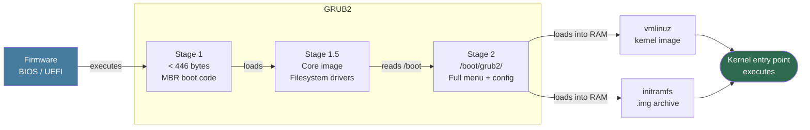
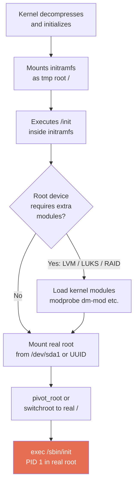
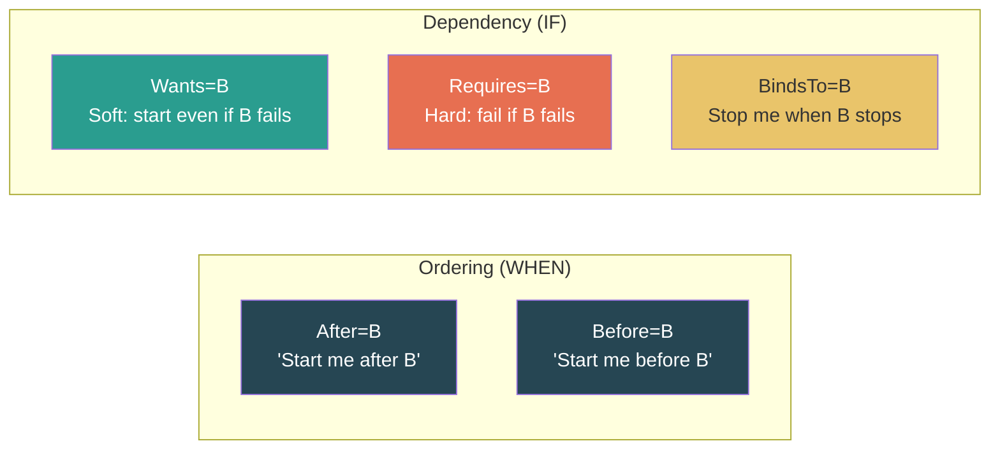

# 02 — The Role of the Bootloader and systemd

## Overview

Between firmware and the running OS sit two critical components:

1. **GRUB2** — the bootloader that loads the Linux kernel into RAM.
2. **systemd** — the init system (PID 1) that starts all services and reaches the target state.

Understanding both is essential for diagnosing boot failures and managing service behavior.

---

## Part 1: GRUB2 (GRand Unified Bootloader, version 2)

GRUB2 is the standard bootloader on all major Linux distributions. Its job is to:
- Locate the kernel on disk
- Load the kernel and initramfs into RAM
- Pass boot parameters to the kernel
- Hand over execution to the kernel

### GRUB2 Three-Stage Architecture



| Stage | Location | Size | Role |
|-------|----------|------|------|
| Stage 1 | First 446 bytes of MBR (BIOS) or `grubx64.efi` on ESP (UEFI) | < 1 KB | Sole purpose: load Stage 1.5 |
| Stage 1.5 | Core image embedded between MBR and first partition (BIOS) | ~32 KB | Contains filesystem drivers; reads `/boot` |
| Stage 2 | `/boot/grub2/` | Several MB | Full GRUB2 environment, menus, modules |

### Key Files

```bash
/etc/default/grub          # Human-editable settings (source of truth)
/boot/grub2/grub.cfg       # Auto-generated at boot; DO NOT edit directly
/etc/grub.d/               # Scripts that generate grub.cfg sections
/boot/grub2/i386-pc/       # BIOS GRUB modules
/boot/grub2/x86_64-efi/    # UEFI GRUB modules
/boot/efi/EFI/             # EFI System Partition bootloader binaries
```

### /etc/default/grub — Common Parameters

```bash
GRUB_DEFAULT=0               # Default menu entry (0-indexed, or "saved")
GRUB_TIMEOUT=5               # Seconds before auto-booting default entry
GRUB_CMDLINE_LINUX="quiet"   # Extra kernel parameters (appended to all entries)
GRUB_DISABLE_RECOVERY=false  # Show recovery entries in menu
```

After editing, regenerate `grub.cfg`:

```bash
# RHEL / Fedora / CentOS
sudo grub2-mkconfig -o /boot/grub2/grub.cfg

# UEFI systems
sudo grub2-mkconfig -o /boot/efi/EFI/fedora/grub.cfg

# Debian / Ubuntu
sudo update-grub
```

### Passing Boot Parameters at Runtime

At the GRUB menu, press `e` to edit the entry temporarily:

```bash
linux /vmlinuz-5.15.0 root=/dev/sda1 ro quiet
# Change "quiet" to "systemd.unit=rescue.target" for rescue mode
# Add "rd.break" to drop into initramfs emergency shell
```

---

## Part 2: initramfs

The **initramfs** (Initial RAM Filesystem) is a compressed CPIO archive that the kernel mounts as a temporary root (`/`) before it can access the real root filesystem.

### Why initramfs Exists

The kernel is compiled with only the most basic built-in drivers. Real-world scenarios require more:

- Root filesystem on **LVM** → needs LVM tools and the `dm-mod` module
- Root filesystem on **LUKS** encrypted partition → needs `cryptsetup`
- Root filesystem on **software RAID** → needs `mdadm`
- Root filesystem on **iSCSI/NFS** → needs network stack at boot

initramfs bundles just enough modules and utilities to handle these before pivoting to the real root.

### initramfs Boot Flow



### Rebuilding initramfs

```bash
# RHEL / Fedora / CentOS — dracut
sudo dracut -f                              # Rebuild for running kernel
sudo dracut -f /boot/initramfs-$(uname -r).img $(uname -r)  # Explicit

# Debian / Ubuntu — mkinitramfs
sudo update-initramfs -u                   # Update for running kernel
sudo update-initramfs -u -k all            # Update for all installed kernels

# Inspect contents
lsinitrd /boot/initramfs-$(uname -r).img   # RHEL
sudo unmkinitramfs /boot/initrd.img-$(uname -r) /tmp/initramfs/  # Ubuntu
```

---

## Part 3: PID 1 and the Transition to systemd

When the kernel finishes booting, it executes the very first user-space process — always assigned **PID 1**. This process is responsible for everything that follows.

### SysV init (Legacy)

- Ran `/etc/rc.d/` shell scripts **sequentially**
- Used **runlevels** (0–6) as discrete system states
- No dependency tracking, no parallelism, no restart logic
- Each service script manually started with `/etc/init.d/service start`

**Boot time on SysV**: Often 60–120 seconds due to serial execution.

### systemd (Modern)

systemd replaced SysV init and is now the default on all major distributions (RHEL 7+, Ubuntu 15.04+, Debian 8+, Fedora 15+, Arch).

**Key improvements over SysV:**

| Feature | SysV init | systemd |
|---------|-----------|---------|
| Startup order | Sequential scripts | Parallel, dependency-resolved |
| Dependency tracking | Manual (S/K script numbering) | Explicit `Wants=`/`Requires=`/`After=` |
| Service restart | Manual or third-party | Built-in `Restart=on-failure` |
| Logging | `/var/log/messages` scattered | Centralized `journald` |
| Timers/cron | `cron` daemon separate | Native `.timer` units |
| Resource limits | `/etc/security/limits.conf` | Per-unit cgroups |
| Boot time | ~60–120s | ~5–15s (parallel) |

```bash
# Verify PID 1 is systemd
ls -la /proc/1/exe
# /proc/1/exe -> /usr/lib/systemd/systemd

# Check systemd version
systemctl --version
```

---

## Part 4: systemd Unit Files

Everything systemd manages is described in a **unit file** — a structured INI-format configuration file.

### Unit File Locations (precedence: top overrides bottom)

```
/etc/systemd/system/       ← Admin/custom units (highest priority)
/run/systemd/system/       ← Runtime-generated units (transient)
/lib/systemd/system/       ← Package-installed units (lowest priority)
```

### Common Unit Types

| Extension | Type | Purpose |
|-----------|------|---------|
| `.service` | Service | Manage a daemon/process |
| `.target` | Target | Group units; define system states |
| `.socket` | Socket | Socket-based activation (start service on first connection) |
| `.timer` | Timer | Schedule service execution (cron replacement) |
| `.mount` | Mount | Manage filesystem mounts |
| `.path` | Path | Watch filesystem paths; trigger services |
| `.device` | Device | React to hardware device events |

### Anatomy of a .service Unit File

```ini
[Unit]
Description=My Application Server        # Human-readable name
Documentation=https://example.com/docs   # Documentation URL
After=network-online.target              # Start ordering (not dependency)
Requires=postgresql.service             # Hard dependency (fail if missing)
Wants=redis.service                     # Soft dependency (optional)

[Service]
Type=simple                             # Process type
ExecStart=/usr/bin/myapp --config /etc/myapp/config.yaml
ExecStop=/bin/kill -15 $MAINPID         # Graceful stop
ExecReload=/bin/kill -HUP $MAINPID      # Config reload without restart
Restart=on-failure                      # Auto-restart on crash
RestartSec=5s                           # Wait 5s before restart
User=myapp                              # Run as this user (not root)
Group=myapp
WorkingDirectory=/var/lib/myapp
StandardOutput=journal                  # Logs go to journald
StandardError=journal

[Install]
WantedBy=multi-user.target              # Enabled in multi-user target
```

### Dependency Directives



> **Note**: `After=` alone does NOT create a dependency — it only sets order. Always combine it with `Wants=` or `Requires=`.

### Essential systemctl Commands

```bash
# Service lifecycle
systemctl start nginx           # Start now
systemctl stop nginx            # Stop now
systemctl restart nginx         # Stop + start
systemctl reload nginx          # Reload config (no restart, if supported)
systemctl status nginx          # Show state, PID, recent logs

# Boot persistence
systemctl enable nginx          # Create symlink so it starts at boot
systemctl disable nginx         # Remove symlink; won't start at boot
systemctl is-enabled nginx      # Check: enabled, disabled, masked?

# Inspection
systemctl list-units --type=service           # All loaded services
systemctl list-units --state=failed           # Failed units
systemctl list-unit-files --type=service      # All installed services + state
systemctl cat nginx                           # Display unit file content
systemctl show nginx                          # All internal properties

# After editing a unit file
sudo systemctl daemon-reload                  # Reload systemd config
```

---

## Key Commands Reference

| Command | Purpose |
|---------|---------|
| `sudo grub2-mkconfig -o /boot/grub2/grub.cfg` | Regenerate GRUB config |
| `cat /proc/cmdline` | Current kernel boot parameters |
| `sudo dracut -f` | Rebuild initramfs (RHEL/Fedora) |
| `sudo update-initramfs -u` | Rebuild initramfs (Debian/Ubuntu) |
| `lsinitrd /boot/initramfs-$(uname -r).img` | List initramfs contents |
| `ls -la /proc/1/exe` | Confirm PID 1 binary path |
| `systemctl --version` | systemd version |
| `systemctl status <unit>` | Service status + recent logs |
| `systemctl daemon-reload` | Reload after editing unit files |
| `systemctl cat <unit>` | View unit file source |
| `journalctl -u <unit> -f` | Follow live logs for a unit |

---

## Common Pitfalls

| Mistake | Clarification |
|---------|--------------|
| Editing `/boot/grub2/grub.cfg` directly | Always edit `/etc/default/grub`, then run `grub2-mkconfig`. The file is overwritten on kernel updates. |
| Forgetting `daemon-reload` after editing a unit file | systemd caches unit files. Always run `systemctl daemon-reload` after any edit before `restart`/`start`. |
| Using `After=` without `Requires=` or `Wants=` | `After=` only sets order. Without a dependency directive, systemd may not pull in the dependency at all. |
| Not using a dedicated service user | Running services as root is a security risk. Always set `User=` and `Group=` in service units. |
