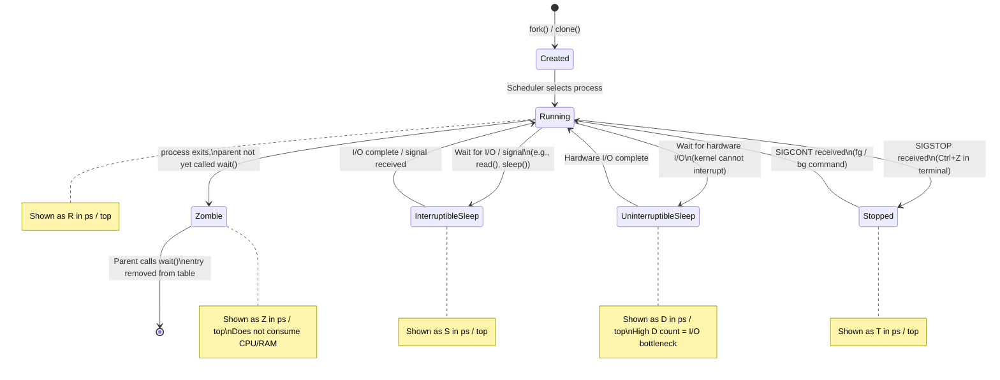
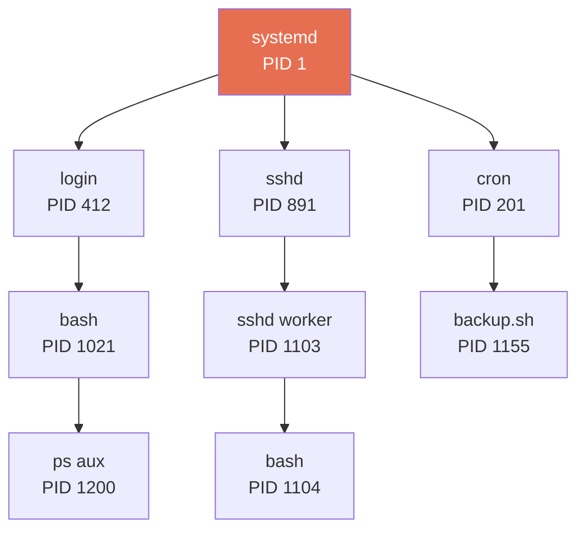

# 03 — Process and Thread Concepts

## Overview

Every running program in Linux is a **process**. Understanding processes — how they are created, how they relate to each other, and what states they move through — is fundamental to diagnosing performance issues, debugging failures, and managing system resources.

---

## Process vs Thread

### Process

A **process** is an independent instance of a running program. The kernel gives each process its own isolated world:

- **Virtual address space** (code, data, heap, stack — all private)
- **File descriptor table** (open files, sockets, pipes)
- **Signal handlers**
- **Environment variables**
- **Working directory**
- **PID** (Process ID — unique system-wide identifier)

### Thread

A **thread** is a lightweight unit of execution that lives *inside* a process. Multiple threads share:

- Same virtual address space (including heap and globals)
- Same file descriptors
- Same signal handlers

But each thread has its own:

- **Stack** (separate function call frames)
- **Registers** and CPU state
- **Thread ID (TID)**

### Key Difference

| Aspect | Process | Thread |
|--------|---------|--------|
| Memory space | Private (isolated) | Shared within process |
| Creation cost | High (full memory copy via CoW) | Low (no memory duplication) |
| Communication | IPC (pipes, sockets, signals) | Shared memory directly |
| Fault isolation | Crash does not affect other processes | One thread crash can kill all threads |
| Context switch cost | Higher (TLB flush, page table switch) | Lower (same page tables) |
| Use case | Isolation (web server workers) | Parallelism (compute threads) |

---

## Process Lifecycle States



### State Codes in `ps` and `top`

| Code | State | Meaning |
|------|-------|---------|
| `R` | Running | On CPU or in run queue, ready to execute |
| `S` | Interruptible Sleep | Waiting for event; wakes on signal |
| `D` | Uninterruptible Sleep | Deep kernel sleep (disk I/O); cannot be killed |
| `T` | Stopped | Paused by `SIGSTOP` or debugger |
| `Z` | Zombie | Exited but not reaped by parent |
| `I` | Idle | Kernel thread, idle |

> **High `D` state count** is a strong signal of I/O bottleneck. Processes stuck in `D` cannot be killed with `kill -9`.

---

## Process Creation: fork() and exec()

### fork()

`fork()` creates an exact copy of the calling process (the **parent**). The new process is the **child**.

- The child is a copy of the parent at the point of `fork()`
- **Copy-on-Write (CoW)**: memory pages are shared read-only initially; a private copy is made only when either process writes to a page
- `fork()` returns:
  - `0` → inside the child process
  - Child's PID → inside the parent process
  - `-1` → error (no process created)

### exec()

`exec()` replaces the current process's memory image with a new program. The PID stays the same; the code, stack, and heap are replaced.

```
Parent                          Child (after fork)
─────────────────────────────   ─────────────────────────────
pid = fork()                    pid = fork()  → returns 0
if pid > 0:                     if pid == 0:
    waitpid(child)                  execvp("nginx", args)
                                    # Only reaches here on exec error
```

### Process Ancestry: The Process Tree



All processes trace back to **PID 1 (systemd)**. Every process has a **PPID** (Parent Process ID).

---

## PID, PPID, and Process Identifiers

| Identifier | Name | Meaning |
|-----------|------|---------|
| PID | Process ID | Unique ID for this process |
| PPID | Parent Process ID | PID of the process that created this one |
| PGID | Process Group ID | Used for job control; signals sent to whole group |
| SID | Session ID | A session contains one or more process groups |
| TID | Thread ID | ID of an individual thread within a process |

```bash
# Show PID, PPID, and command
ps -eo pid,ppid,comm

# Tree view showing parent-child relationships
pstree -p

# All details for a specific process
cat /proc/1234/status | grep -E "Pid|PPid|State|Threads"
```

---

## Zombie and Orphan Processes

### Zombie Process

When a process exits, it does not immediately disappear. Its **exit code and resource usage statistics** must be read by the parent via `wait()`. Until then, the process remains as a **zombie** — no CPU, no memory, but still occupying a slot in the process table.

- A few zombies are normal (transient)
- **Many persistent zombies** = bug in the parent (not calling `wait()`)
- Zombies go away when the parent reads their status OR when the parent itself exits

### Orphan Process

An **orphan** is a process whose parent has exited before it. The kernel automatically **re-parents** orphans to **PID 1 (systemd/init)**, which promptly calls `wait()` to clean them up.

---

## Thread Inspection

```bash
# Show threads of a process (each TID)
ps -L -p <pid>
# PID    LID  ...   COMMAND
# 1234  1234         nginx
# 1234  1235         nginx
# 1234  1236         nginx

# Interactive thread view in top
top -H

# Count threads for a process
cat /proc/<pid>/status | grep Threads
```

---

## Key Commands Reference

| Command | Purpose |
|---------|---------|
| `ps aux` | Snapshot of all processes: USER, PID, %CPU, %MEM, STAT, COMMAND |
| `ps -ef` | Full-format listing with PPID |
| `ps -eo pid,ppid,stat,comm` | Custom columns |
| `ps aux --sort=-%cpu` | Processes sorted by CPU usage (descending) |
| `ps aux --sort=-%mem` | Processes sorted by memory usage (descending) |
| `pstree -p` | Visual process tree with PIDs |
| `pstree -u` | Show username for each process |
| `top` | Live interactive monitor (press `k` to kill, `r` to renice) |
| `top -H` | Show individual threads instead of processes |
| `cat /proc/<pid>/status` | Detailed: state, memory, threads, signals |
| `ls /proc/<pid>/fd/` | Open file descriptors for a process |
| `kill -9 <pid>` | Force-terminate a process (SIGKILL, cannot be caught) |
| `kill -15 <pid>` | Graceful terminate (SIGTERM, the default) |
| `kill -STOP <pid>` | Pause a process (SIGSTOP) |
| `kill -CONT <pid>` | Resume a paused process (SIGCONT) |

### Practical One-liners

```bash
# Find top 5 CPU-consuming processes
ps aux --sort=-%cpu | head -6

# Find top 5 memory-consuming processes
ps aux --sort=-%mem | head -6

# Find all zombie processes
ps aux | awk '$8 == "Z"'

# List all threads of process 1234
ps -L -p 1234

# Check if a process is still alive
ps -p 1234 > /dev/null && echo "alive" || echo "gone"
```

---

## Common Pitfalls

| Mistake | Clarification |
|---------|--------------|
| Confusing `kill` with "delete" | `kill` sends a signal (default: SIGTERM = graceful stop). Use `kill -9` only as a last resort — it gives the process no chance to clean up. |
| Thinking `D` state processes can be killed | Processes in Uninterruptible Sleep (`D`) cannot be killed. The only fix is resolving the underlying I/O issue or rebooting. |
| Not understanding zombie processes | Zombies consume no CPU or RAM. They are not a performance problem unless thousands accumulate (process table exhaustion). |
| Mixing up PID and TID | `ps aux` shows PIDs. `ps -L` shows TIDs. `top -H` shows both. They are different namespaces. |
