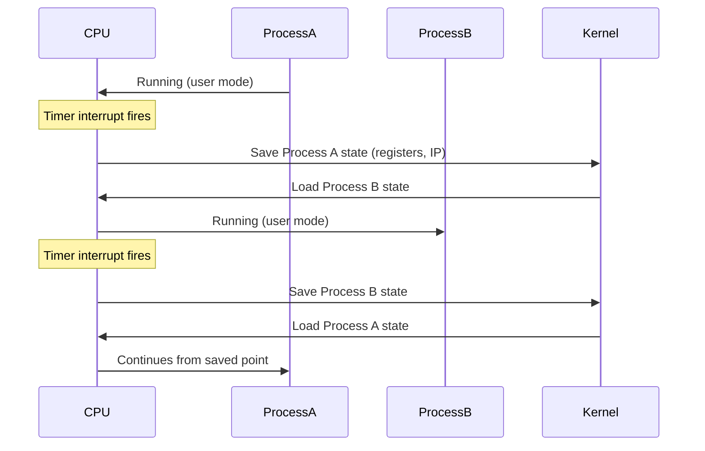
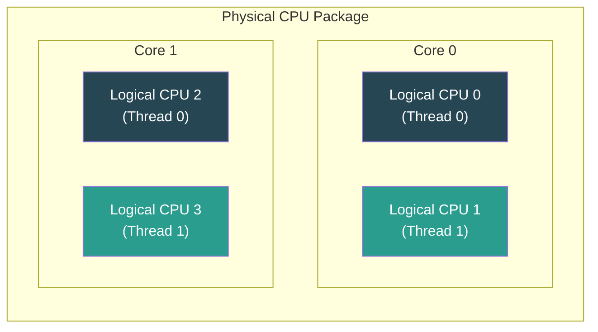
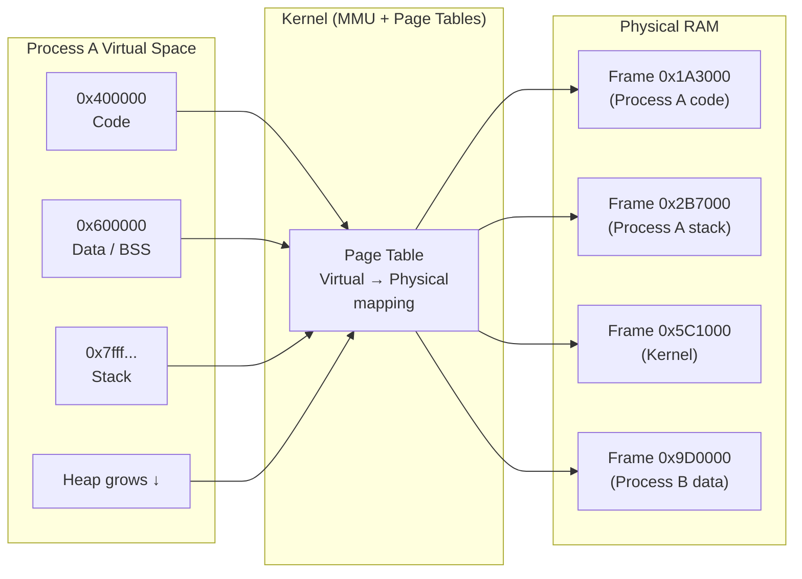

# 04 — Memory and CPU Concepts

## Overview

Memory and CPU are the two primary resources every process competes for. A DevOps engineer must understand how Linux manages them — not to tune the kernel scheduler, but to **read monitoring output correctly**, identify bottlenecks, and make informed operational decisions.

---

## Part 1: CPU Concepts

### User Time vs Kernel Time

Every CPU second is categorized:

| Category | Symbol | Meaning |
|----------|--------|---------|
| **user** | `us` | CPU executing application code (your program) |
| **system** (kernel) | `sy` | CPU executing kernel code on behalf of a process (syscalls, I/O) |
| **idle** | `id` | CPU has nothing to do |
| **I/O wait** | `wa` | CPU is idle, waiting for a disk/network I/O to complete |
| **hardware IRQ** | `hi` | CPU handling hardware interrupts |
| **software IRQ** | `si` | CPU handling software interrupts |
| **steal** | `st` | Time stolen by the hypervisor (VMs only) |

```
top - 10:15:02 up 5 days ...
%Cpu(s): 22.3 us,  5.1 sy,  0.0 ni, 71.4 id,  1.0 wa,  0.0 hi,  0.2 si,  0.0 st
          ────                               ────
          High user = CPU-bound app          High wa = I/O bottleneck
```

### Context Switching

When the kernel switches the CPU from one process to another, it:

1. **Saves** the current process's CPU state (registers, instruction pointer, stack pointer) into the process's kernel stack
2. **Loads** the next process's saved state
3. **Flushes** relevant CPU caches (TLB entries for the old process's address space)



**Cost**: 1–10 microseconds direct + indirect cache miss penalty. High context switch rates (`cs` column in `vmstat`) combined with high load average can indicate a thrashing system.

### Load Average

Load average is the **average number of processes in the run queue** (state R) over 1, 5, and 15 minutes. It includes:
- Processes actively using the CPU
- Processes waiting for CPU time (runnable but not scheduled)
- Processes in **Uninterruptible Sleep** (D state — waiting for I/O)

```bash
uptime
# 10:15:02 up 5 days, 2 users,  load average: 2.10, 1.85, 1.60
#                                              ──────────────────
#                                              1min  5min  15min
```

**Interpretation**: Compare load average to number of logical CPUs.

```bash
nproc   # e.g., returns 4

# Load 2.0 on 4-core system = 50% saturation (healthy)
# Load 4.0 on 4-core system = fully saturated (borderline)
# Load 6.0 on 4-core system = overloaded; processes queuing
```

> **Common mistake**: Load average is NOT the same as CPU percentage. A system can have 100% CPU usage with a low load average (one heavy process) or a high load average with moderate CPU (many I/O-blocked processes).

### CPU Cores vs Logical Threads (Hyperthreading)



- **Intel Hyperthreading (HT)** / **AMD SMT**: 1 physical core presents as 2 logical CPUs to the OS
- Both logical CPUs share execution units and L1/L2 cache — **not** full parallelism
- Actual throughput gain: ~20–30%, not 100%
- `nproc` returns logical CPUs (includes HT); `lscpu` shows the full topology

```bash
lscpu
# CPU(s):              4
# Thread(s) per core:  2    ← Hyperthreading enabled
# Core(s) per socket:  2
# Socket(s):           1

nproc                  # 4 (logical CPUs)
```

---

## Part 2: Memory Concepts

### Virtual Memory and Physical Memory

Every process operates in its own **virtual address space** — it believes it has the entire memory range from address `0` to `2^64`. This is an abstraction managed by the kernel.



**Benefits of virtual memory**:
- **Isolation**: Process A cannot read or write Process B's memory
- **Overcommit**: More virtual memory can be allocated than physical RAM (kernel pages out cold data to swap)
- **Relocation**: Programs do not need to be loaded at a fixed physical address

### Paging

Memory is divided into fixed-size chunks called **pages** (typically 4 KB on x86_64).

| Event | Type | Cost |
|-------|------|------|
| Access a page that is in RAM but not in TLB | **Soft page fault** | ~100 CPU cycles |
| Access a page that has been swapped to disk | **Hard page fault** | ~10 ms (10 million cycles) |

**Copy-on-Write (CoW)** after `fork()`:
1. Child's page table entries point to the same physical frames as parent
2. Both entries are marked read-only
3. On first write by either process → kernel allocates a new frame and copies the page

### Swap

**Swap** is disk space (partition or file) used as overflow when physical RAM is exhausted. The kernel **pages out** (writes cold pages to swap) to free RAM for active processes.

```
RAM (fast, ns latency) ←────────────── Active pages
                               page out ↓       ↑ page in
Swap (slow, ms latency) ─────────────── Cold pages
```

```bash
# View swap usage
free -h
# Mem:   15.6G   8.2G   3.1G   512M   4.3G   6.8G
# Swap:   4.0G   100M   3.9G

# Monitor swap activity (si = swap in pages/s, so = swap out pages/s)
vmstat 1
# High si/so values = active swapping = performance problem

# Swap devices
cat /proc/swaps
swapon --show
```

> **Operational rule**: Persistent swap usage (`si`/`so` > 0 sustained) on a production server is a signal to add RAM or fix a memory leak, not to add more swap.

### How Linux Uses Free Memory for Cache

Linux never lets RAM sit truly idle. The kernel uses all "free" RAM as **page cache** — a buffer for recently read/written files.

```
┌──────────────────────────────────────────────────────┐
│                    Physical RAM                      │
├─────────────┬──────────────────────────┬─────────────┤
│  Kernel     │   Process RSS (used)     │ Page Cache  │
│  (fixed)    │   (stack, heap, code)    │ (free→cache)│
└─────────────┴──────────────────────────┴─────────────┘
```

**`free -h` output explained**:
```
              total    used    free    shared  buff/cache  available
Mem:          15.6G    8.2G    1.1G     512M       6.3G       6.8G
                       ────           ────────────────────   ─────
                       RSS +           Disk cache             RAM you
                       kernel          (reclaimable)          can actually use
```

- `available` = `free` + reclaimable portion of `buff/cache`
- **Never alarm on low `free` alone** — look at `available`
- Cache is evicted automatically when processes need more RAM

### OOM Killer

When both RAM and swap are exhausted, the kernel **OOM (Out-of-Memory) killer** selects and terminates a process to free memory.

**Selection**: Each process has an `oom_score` (0–1000). Higher = more likely to be killed. Factors: memory usage, process age, child processes.

```bash
# View a process's OOM score
cat /proc/$(pgrep nginx | head -1)/oom_score

# Protect a critical process from OOM kill (-1000 = immune)
echo -1000 | sudo tee /proc/<pid>/oom_score_adj

# Mark a process for early kill (+1000)
echo 1000 | sudo tee /proc/<pid>/oom_score_adj

# Detect past OOM kills in logs
sudo dmesg | grep -i "out of memory"
sudo journalctl | grep -i "oom"
```

---

## Key Commands Reference

| Command | Purpose |
|---------|---------|
| `lscpu` | CPU topology: sockets, cores, threads, cache sizes |
| `nproc` | Number of logical CPUs available |
| `cat /proc/cpuinfo` | Per-core details: model, MHz, flags |
| `uptime` | Load average (1/5/15 min) |
| `vmstat 1 5` | CPU, memory, swap, I/O, context switches — 5 samples, 1s interval |
| `free -h` | Memory summary: total/used/free/available/cache |
| `cat /proc/meminfo` | Detailed kernel memory statistics |
| `cat /proc/<pid>/status` | Per-process: VmRSS (physical), VmVirt (virtual), Threads |
| `cat /proc/swaps` | Active swap devices |
| `swapon --show` | Formatted swap device list |
| `dmesg \| grep -i oom` | Check for past OOM kill events |

### Memory Interpretation One-liners

```bash
# How much memory is actually available
free -h | awk '/^Mem:/ {print "Available: " $7}'

# Total swap used
free -h | awk '/^Swap:/ {print "Swap used: " $3 " of " $2}'

# Top 5 processes by RSS (resident physical memory)
ps aux --sort=-%mem | awk 'NR<=6 {printf "%-10s %5s %5s %s\n",$1,$3,$4,$11}'

# Is the system swapping right now?
vmstat 1 3 | awk 'NR>2 {if ($7>0 || $8>0) print "SWAPPING: si=" $7 " so=" $8}'
```

---

## Common Pitfalls

| Mistake | Clarification |
|---------|--------------|
| Panicking over low `free` memory | Linux intentionally uses free RAM as cache. Check `available`, not `free`. |
| Treating load average as CPU% | Load average counts queued processes including I/O waiters. A system can be I/O bottlenecked at low CPU% but high load average. |
| Ignoring `wa` CPU time | High I/O wait (`wa`) means CPUs are idle waiting on disk. This is often more impactful than high `us`. |
| Adding swap instead of fixing memory leaks | Swap is a safety net, not a solution. Sustained swapping destroys performance. |
| `kill -9` on a process in `D` state | Processes in Uninterruptible Sleep cannot be killed. The root cause is always an I/O hang — fix the disk/NFS/network issue. |
