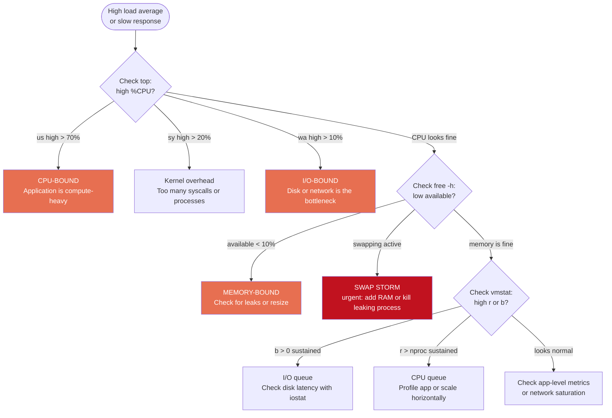

# 06 — Resource Usage Analysis (CPU, RAM, Load)

## Overview

Collecting raw metrics is only half the job. The real skill is **interpreting them**. This file teaches you to read the output of `top`, `free`, `vmstat`, and `ps` — and to translate numbers into operational decisions like "this system is CPU-bound" or "memory pressure is causing swap activity."

---

## Interpreting `top` Output

`top` is an interactive real-time monitor. Its output has two sections: the **summary header** and the **process list**.

### Header Section — Annotated

```
top - 14:32:45 up 45 days, 3:22,  2 users,  load average: 2.10, 1.85, 1.60
Tasks: 245 total,   2 running, 243 sleeping,   0 stopped,   0 zombie
%Cpu(s): 42.3 us,  8.1 sy,  0.0 ni, 48.4 id,  1.0 wa,  0.0 hi,  0.2 si
MiB Mem :  15935.6 total,   1823.4 free,   8421.2 used,   5691.0 buff/cache
MiB Swap:   4096.0 total,   3982.4 free,    113.6 used.   7194.3 avail Mem
```

**Line 1 — System snapshot**:
```
top - 14:32:45 up 45 days, 3:22,  2 users,  load average: 2.10, 1.85, 1.60
       │         │                             │            │     │     │
       │         │                             │            │     │     └─ 15-min load avg
       │         │                             │            │     └─ 5-min load avg
       │         │                             │            └─ 1-min load avg
       │         └─ uptime (45d 3h 22min)      └─ logged-in users
       └─ current time
```

**Line 2 — Task summary**:
- `running`: processes actively on CPU or in run queue (R state)
- `sleeping`: waiting for I/O or event (S state) — normal
- `zombie`: exited but not reaped — investigate if count grows

**Line 3 — CPU breakdown**:
```
%Cpu(s): 42.3 us,  8.1 sy,  0.0 ni, 48.4 id,  1.0 wa,  0.0 hi,  0.2 si
          │          │               │           │
          │          │               └─ idle     └─ I/O wait
          │          └─ kernel/system time
          └─ user-space time
```

| Value | What it signals |
|-------|----------------|
| High `us` (>70%) | CPU-bound workload (application is compute-heavy) |
| High `sy` (>20%) | Many system calls / kernel work (too many processes, I/O storms) |
| High `wa` (>10%) | I/O bottleneck — disk or network is the constraint |
| High `st` | Hypervisor is stealing CPU time (VM is over-subscribed) |
| Low `id` (near 0) | System is very busy — investigate further |

**Lines 4–5 — Memory**:

| Field | Meaning |
|-------|---------|
| `total` | Total physical RAM |
| `free` | RAM with absolutely no use |
| `used` | RAM used by processes (RSS) + kernel overhead |
| `buff/cache` | Disk cache; **reclaimable** when processes need memory |
| `avail Mem` | RAM that can actually be given to a new process (`free` + reclaimable cache) |

> **Alert on `avail Mem` being low, not on `free` being low.**

### Process List — Column Reference

```
  PID USER      PR  NI    VIRT    RES    SHR S  %CPU  %MEM     TIME+ COMMAND
 1234 nginx     20   0  245320  15312   9876 S   2.5   0.1   0:15.34 nginx
 5678 postgres  20   0  512M   256M    64M  D  12.0   1.6   1:42.00 postgres
```

| Column | Meaning |
|--------|---------|
| `PID` | Process ID |
| `USER` | Owner username |
| `PR` | Scheduling priority (lower = higher priority) |
| `NI` | Nice value (-20 to +19; lower = more CPU-greedy) |
| `VIRT` | Virtual memory allocated (not necessarily in RAM) |
| `RES` | Resident Set Size — actual physical RAM in use |
| `SHR` | Shared memory (shared libraries, etc.) |
| `S` | State: R=running, S=sleeping, D=uninterruptible, Z=zombie |
| `%CPU` | CPU usage averaged since last update |
| `%MEM` | % of physical RAM (RES / total RAM) |
| `TIME+` | Total CPU time consumed since process started |
| `COMMAND` | Executable name |

**Interactive `top` keys**:

| Key | Action |
|-----|--------|
| `P` | Sort by CPU usage |
| `M` | Sort by memory usage |
| `k` | Kill process (enter PID) |
| `r` | Renice process (change priority) |
| `H` | Toggle thread view |
| `1` | Toggle per-CPU stats |
| `q` | Quit |

---

## Interpreting `free -h` Output

```bash
free -h
#               total        used        free      shared  buff/cache   available
# Mem:          15.6G        8.2G        1.1G        512M        6.3G        6.8G
# Swap:          4.0G        100M        3.9G
```


**Decision table**:

| `available` | Swap `used` | Interpretation |
|------------|------------|----------------|
| > 20% of total | 0 | Healthy |
| 10–20% of total | 0 | Monitor; may increase under load |
| < 10% of total | Rising | Memory pressure; investigate leaks |
| Any | Rising rapidly | Active swapping; performance degraded |

---

## Interpreting `vmstat` Output

`vmstat` gives a snapshot of system-wide activity: processes, memory, swap, I/O, interrupts, and CPU.

```bash
vmstat 1 5
# procs -------memory------ ---swap-- -----io---- -system-- ------cpu-----
#  r  b   swpd   free   buff  cache   si   so    bi    bo   in   cs us sy id wa st
#  2  0      0 1823456 245624 5823112   0    0     5     2   45  400 42  8 49  1  0
#  3  1    256 1120340 245624 5823112  12    4   128    64  156  820 65 10 20  5  0
```

### Column Reference

| Section | Column | Meaning |
|---------|--------|---------|
| **procs** | `r` | Processes in run queue (ready to use CPU) |
| **procs** | `b` | Processes in Uninterruptible Sleep (blocked on I/O) |
| **memory** | `swpd` | Amount of swap in use (KB) |
| **memory** | `free` | Free memory (KB) |
| **memory** | `buff` | Kernel buffer cache |
| **memory** | `cache` | Page cache |
| **swap** | `si` | Swap pages read in from disk per second (swap in) |
| **swap** | `so` | Swap pages written to disk per second (swap out) |
| **io** | `bi` | Blocks received from block device (disk read) per second |
| **io** | `bo` | Blocks sent to block device (disk write) per second |
| **system** | `in` | Interrupts per second |
| **system** | `cs` | Context switches per second |
| **cpu** | `us` | User time % |
| **cpu** | `sy` | System (kernel) time % |
| **cpu** | `id` | Idle time % |
| **cpu** | `wa` | I/O wait % |
| **cpu** | `st` | Steal time % (VMs) |

**Reading the second `vmstat` line above**:
- `r=3` → 3 processes want CPU; `b=1` → 1 blocked on I/O
- `si=12, so=4` → Active swapping! System is under memory pressure
- `cs=820` → 820 context switches/s (high for low workload)
- `wa=5` → 5% I/O wait (not severe, but combined with `b=1` warrants investigation)

---

## Bottleneck Decision Tree



---

## `ps` for Sorting and Filtering

Unlike `top`, `ps` is a **non-interactive snapshot** — useful in scripts and one-liners.

```bash
# Top 10 processes by CPU
ps aux --sort=-%cpu | head -11

# Top 10 processes by memory (RSS)
ps aux --sort=-%mem | head -11

# Custom output: PID, user, RSS, virtual, CPU%, command
ps -eo pid,user,rss,vsz,%cpu,comm --sort=-%cpu | head -11

# Show a specific process and its children
ps -ef | grep nginx

# Show all processes in tree format
ps -ef --forest
```

**`ps aux` column meanings**:
```
USER      PID  %CPU %MEM    VSZ   RSS TTY   STAT  START   TIME COMMAND
nginx    1234   2.5  0.1  24532 15312 ?     S    10:30   0:15 nginx: worker
```

| Column | Meaning |
|--------|---------|
| `%CPU` | Average CPU since process started (not current second) |
| `%MEM` | RSS / total physical RAM |
| `VSZ` | Virtual memory size (KB) — includes all mapped memory |
| `RSS` | Resident Set Size (KB) — actual physical RAM in use |
| `STAT` | Process state: `S`=sleeping, `R`=running, `D`=uninterruptible, `Z`=zombie |
| `TIME` | Total cumulative CPU time used |

---

## Key Commands Reference

| Command | When to Use |
|---------|------------|
| `top` | Interactive real-time monitoring |
| `top -b -n 1` | Batch mode — capture one snapshot (for scripts) |
| `free -h` | Quick memory summary |
| `vmstat 1 10` | 10-second profile of CPU/memory/swap/I/O |
| `ps aux --sort=-%cpu \| head -11` | What is consuming the most CPU right now? |
| `ps aux --sort=-%mem \| head -11` | What is consuming the most memory right now? |
| `watch -n 2 'free -h'` | Watch memory every 2 seconds |
| `watch -n 1 'ps aux --sort=-%cpu \| head -11'` | Watch top CPU consumers |

---

## Common Pitfalls

| Mistake | Clarification |
|---------|--------------|
| Treating `%CPU` in `ps` as current usage | `ps %CPU` is the CPU average over the process's entire lifetime, not the current second. Use `top` for current rates. |
| Alarming on `free` = 0 | Linux uses all available RAM as cache. Check `available` in `free -h` or `top` header. |
| Ignoring `wa` in CPU stats | High I/O wait is often a bigger problem than high `us`. A disk bottleneck shows up as high `wa` and low `id`. |
| Misreading load average | Load average of 4.0 on a 4-core system is fully loaded; on an 8-core system it is only 50% loaded. Always compare to `nproc`. |
