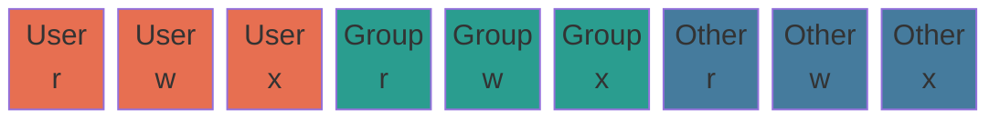

# 07 — Permission and Ownership Concepts

## Overview

Linux enforces access control through a simple but powerful model: every file and directory has an **owner**, a **group**, and a set of **permission bits** that control who can read, write, or execute it. Misunderstanding permissions is one of the most common causes of "permission denied" errors and security vulnerabilities.

---

## The Permission Model

Every file and directory has three attributes:

1. **Owner** (user): The user account that owns the file.
2. **Group**: A group of users that share access.
3. **Other**: Everyone else on the system.

For each of these three categories, three permissions can be set:

| Permission | Symbol | Octal | On a File | On a Directory |
|-----------|--------|-------|-----------|---------------|
| Read | `r` | `4` | View file contents | List directory contents (`ls`) |
| Write | `w` | `2` | Modify file contents | Create, delete, or rename files inside |
| Execute | `x` | `1` | Run file as program | Enter directory (`cd`) and access contents |

---

## Reading Permission Strings

```bash
ls -l /etc/passwd
# -rw-r--r-- 1 root root 2421 Jun 15 09:00 /etc/passwd
# │││││││││ │ │    │
# │││││││││ │ │    └─ group owner
# │││││││││ │ └─ user owner
# │││││││││ └─ hard link count
# ││││││└──── other: r-- (read only)
# │││└──────── group: r-- (read only)
# └────────── user:  rw- (read + write)
# └ file type: - (regular file), d (directory), l (symlink), c (char device), b (block device)
```

### Permission Bit Layout



### Octal Notation

Each category (user/group/other) is represented by a single octal digit (sum of its bits):

```
r = 4
w = 2
x = 1

rwx = 4+2+1 = 7
rw- = 4+2+0 = 6
r-x = 4+0+1 = 5
r-- = 4+0+0 = 4
-wx = 0+2+1 = 3
-w- = 0+2+0 = 2
--x = 0+0+1 = 1
--- = 0+0+0 = 0
```

**Common permission patterns**:

| Octal | Symbolic | Typical Use |
|-------|----------|-------------|
| `755` | `rwxr-xr-x` | Executables, public directories |
| `644` | `rw-r--r--` | Regular files (config files, docs) |
| `600` | `rw-------` | Private files (SSH keys, secrets) |
| `700` | `rwx------` | Private directories |
| `777` | `rwxrwxrwx` | World-writable — avoid on production |
| `640` | `rw-r-----` | Files readable by group, not others |
| `400` | `r--------` | Read-only (e.g., SSH private key on disk) |

---

## Special Permission Bits

Beyond the standard rwx, three additional bits add elevated behavior.

### SUID — Set User ID (octal prefix: `4`)

When set on an **executable**, the program runs with the **file owner's privileges**, not the caller's.

```bash
ls -l /usr/bin/passwd
# -rwsr-xr-x 1 root root 59976 Mar 12 2023 /usr/bin/passwd
#    ^
#    's' in user execute position = SUID set
```

- `passwd` must write to `/etc/shadow` (owned by root)
- A normal user runs it — but it executes as `root` due to SUID
- The `s` appears in the **user execute** position
- If the execute bit is not also set: `S` (uppercase) = SUID without execute (usually a misconfiguration)

```bash
chmod u+s /path/to/binary    # Set SUID
chmod 4755 /path/to/binary   # Same, using octal prefix
```

### SGID — Set Group ID (octal prefix: `2`)

On an **executable**: runs with the file's **group** privileges.
On a **directory**: new files inherit the **directory's group** (useful for shared project folders).

```bash
ls -ld /shared/project/
# drwxrwsr-x 2 alice developers 4096 Jun 15 10:00 /shared/project/
#       ^
#       's' in group execute position = SGID set

chmod g+s /shared/project/   # Set SGID on directory
chmod 2775 /shared/project/  # Same, using octal prefix
```

### Sticky Bit (octal prefix: `1`)

On a **directory**: only the **file's owner** (or root) can delete or rename files, even if the directory is world-writable.

```bash
ls -ld /tmp
# drwxrwxrwt 14 root root 4096 Jun 18 12:00 /tmp
#          ^
#          't' in other execute position = sticky bit set

chmod +t /shared/uploads/
chmod 1777 /tmp             # Standard /tmp permissions
```

### Setting All Three Together

```bash
# Format: [special][user][group][other]
chmod 4755 binary    # SUID + 755
chmod 2775 dir/      # SGID + 775
chmod 1777 /tmp/     # Sticky + 777
chmod 6755 binary    # SUID + SGID + 755
```

---

## umask — Default Permission Mask

`umask` defines which permissions are **removed** from newly created files and directories.

```bash
umask         # View current mask (typically 0022)
```

**Calculation**:
- New file base: `0666` (no execute — files are not executable by default)
- New directory base: `0777`
- Subtract the mask:

```
Default umask: 0022

File:      0666 - 0022 = 0644  →  rw-r--r--
Directory: 0777 - 0022 = 0755  →  rwxr-xr-x
```

| umask | New File | New Directory | Use Case |
|-------|----------|--------------|----------|
| `0022` | `644` | `755` | Standard (readable by all) |
| `0027` | `640` | `750` | Group-readable, others excluded |
| `0077` | `600` | `700` | Private (owner only) — security hardening |

```bash
# Set umask for current session
umask 0077

# Make persistent for a user
echo 'umask 0077' >> ~/.bashrc
```

---

## Commands Reference

### `chmod` — Change Permissions

```bash
# Absolute (octal) mode
chmod 755 script.sh          # rwxr-xr-x
chmod 644 config.yaml        # rw-r--r--
chmod 600 ~/.ssh/id_rsa      # rw------- (required for SSH keys)

# Symbolic (relative) mode
chmod u+x script.sh          # User: add execute
chmod g-w file.txt           # Group: remove write
chmod o= file.txt            # Other: remove all permissions
chmod a+r file.txt           # All: add read
chmod ug+rw file.txt         # User+Group: add read and write

# Recursive (apply to directory and all contents)
chmod -R 755 /var/www/html/

# Special bits (symbolic)
chmod u+s /usr/local/bin/mytool   # SUID
chmod g+s /shared/project/        # SGID
chmod +t /shared/uploads/          # Sticky bit
```

### `chown` — Change Owner and Group

```bash
chown alice file.txt              # Change user owner only
chown alice:developers file.txt   # Change user and group
chown :developers file.txt        # Change group only (same as chgrp)
chown -R alice:web /var/www/      # Recursive

# Common use case: fix web server ownership
sudo chown -R www-data:www-data /var/www/html/
```

### `chgrp` — Change Group

```bash
chgrp developers /shared/project/
chgrp -R developers /shared/project/
```

### ACLs — Access Control Lists (Extended Permissions)

When you need more than user/group/other (e.g., grant one specific user extra access), use ACLs:

```bash
# Grant alice read+write access to a file without changing owner
setfacl -m u:alice:rw file.txt

# Grant developers group read access
setfacl -m g:developers:r file.txt

# View current ACLs
getfacl file.txt
# file: file.txt
# owner: bob
# group: ops
# user::rw-
# user:alice:rw-     ← ACL entry
# group::r--
# mask::rw-
# other::r--

# Remove a specific ACL entry
setfacl -x u:alice file.txt

# Remove all ACLs
setfacl -b file.txt
```

A `+` in `ls -l` output indicates a file has ACL entries:
```bash
ls -l file.txt
# -rw-rw-r--+ 1 bob ops 512 Jun 18 file.txt
#           ^── ACL present
```

---

## Security Audit: Finding Dangerous Permissions

```bash
# Find all SUID files on the system (important for security audits)
find / -perm /4000 -type f 2>/dev/null

# Find all SGID files
find / -perm /2000 -type f 2>/dev/null

# Find world-writable files (potential security risk)
find / -perm /o+w -type f 2>/dev/null

# Find files with no owner (orphaned files)
find / -nouser 2>/dev/null

# Check SSH key permissions (must be 600)
ls -la ~/.ssh/
```

---

## Common Pitfalls

| Mistake | Clarification |
|---------|--------------|
| `Permission denied` when running a script | The script likely lacks execute permission. Run `chmod +x script.sh` first. |
| Wrong owner after `cp` | `cp` creates a new file owned by the user running `cp`. Use `cp -p` to preserve original ownership. |
| Setting permissions on symlink target | `chmod` and `chown` on a symlink affect the **target** file, not the symlink itself. |
| `777` on production files | World-writable files can be modified by any user. Always use the most restrictive permissions that allow the application to function. |
| SSH key permission errors | OpenSSH rejects private keys not set to `600`. Run `chmod 600 ~/.ssh/id_rsa`. |
| Forgetting recursive flag | `chmod 755 /var/www/` without `-R` only changes the directory, not its contents. |
