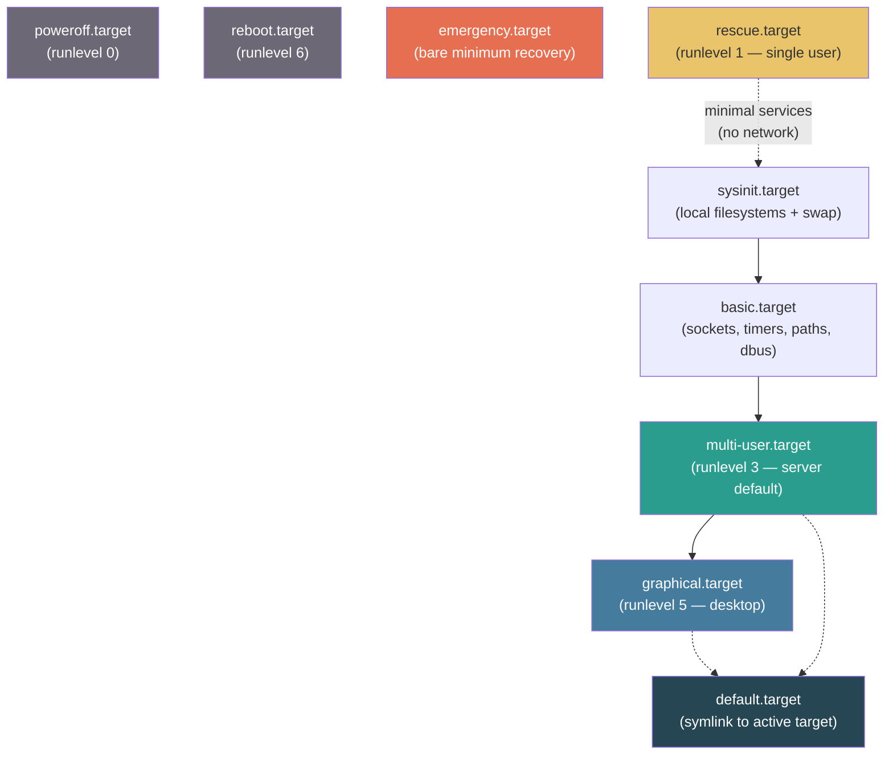
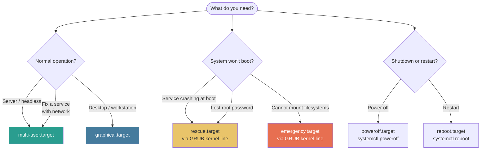

# 08 — Common systemd Targets

## Overview

A **systemd target** is a special unit type that represents a specific system state — a named milestone that groups related units together and defines what services should be running at that point. Targets are the modern replacement for **SysV runlevels**.

---

## Targets vs SysV Runlevels

| SysV Runlevel | Meaning | systemd Target Equivalent |
|---------------|---------|--------------------------|
| `0` | Halt (power off) | `poweroff.target` |
| `1` | Single-user (maintenance, no network) | `rescue.target` |
| `2` | Multi-user, no networking (Debian) | `multi-user.target` |
| `3` | Multi-user, networking, no GUI | `multi-user.target` |
| `4` | Unused (custom) | `multi-user.target` |
| `5` | Multi-user + GUI | `graphical.target` |
| `6` | Reboot | `reboot.target` |
| `S` / `s` | Single-user emergency | `emergency.target` |

> Unlike runlevels, targets can coexist. A system running `graphical.target` is also running `multi-user.target` (as a dependency). Targets are additive, not mutually exclusive states.

---

## Target Dependency Hierarchy



Each target `Requires=` its parent in the chain. You cannot reach `graphical.target` without first reaching `multi-user.target` → `basic.target` → `sysinit.target`.

---

## Core Targets — In Depth

### `sysinit.target`

The first significant milestone after the kernel starts. Responsible for:
- Mounting local filesystems (reads `/etc/fstab`)
- Activating swap
- Setting hostname
- Loading kernel modules
- Setting system clock
- Starting udev (device manager)

No network, no user services — purely local system initialization.

---

### `basic.target`

Extends `sysinit.target` with:
- Socket units (socket activation infrastructure)
- Timer units
- Path units
- D-Bus (inter-process communication bus)
- SELinux / AppArmor policy loading

---

### `multi-user.target`

The standard target for **servers and headless systems**. Provides:
- Full networking
- SSH daemon
- All normal system services (web server, database, etc.)
- Multi-user login (TTY consoles)
- Does **not** start any graphical display manager

```ini
# /lib/systemd/system/multi-user.target
[Unit]
Description=Multi-User System
Documentation=man:systemd.special(7)
Requires=basic.target
Conflicts=rescue.service rescue.target
After=basic.target rescue.service rescue.target
AllowIsolate=yes
```

**Services that target `multi-user.target`** (common):
- `sshd.service`
- `nginx.service` / `httpd.service`
- `postgresql.service`
- `docker.service`
- `cron.service`

---

### `graphical.target`

The standard target for **desktop and workstation systems**. Extends `multi-user.target` with:
- A **display manager** (e.g., `gdm.service`, `lightdm.service`, `sddm.service`)
- X.org or Wayland compositor
- All graphical session infrastructure

```ini
# /lib/systemd/system/graphical.target
[Unit]
Description=Graphical Interface
Documentation=man:systemd.special(7)
Requires=multi-user.target
Wants=display-manager.service
Conflicts=rescue.service rescue.target
After=multi-user.target rescue.service rescue.target display-manager.service
AllowIsolate=yes
```

---

### `rescue.target`

A **minimal single-user environment** for system maintenance and repair:
- Mounts local filesystems (read-write)
- Does **not** start networking
- Does **not** start most services
- Requires root password to access
- Equivalent to SysV runlevel 1

**When to use**: Cannot boot normally; need to fix `/etc/fstab`, recover from a failed service that blocks boot, or reset root password.

**How to boot into rescue**:
```bash
# Method 1: Set permanently (resets to default after fix)
sudo systemctl set-default rescue.target
sudo reboot

# Method 2: At GRUB menu — add to kernel line
systemd.unit=rescue.target

# Method 3: From a running system
sudo systemctl isolate rescue.target
```

---

### `emergency.target`

More minimal than `rescue.target`:
- Mounts root filesystem as **read-only**
- Starts almost no services
- Used when `rescue.target` itself cannot be reached (e.g., corrupt filesystem)
- Root password required

**When to use**: Severe boot failure, filesystem corruption, lost `rescue.target`.

```bash
# Boot into emergency from GRUB kernel line:
systemd.unit=emergency.target

# Or add "emergency" to the kernel command line (shorthand)
```

---

### `poweroff.target` and `reboot.target`

```bash
# Shutdown (power off)
sudo systemctl poweroff          # graceful
sudo systemctl isolate poweroff.target  # same

# Reboot
sudo systemctl reboot
sudo systemctl isolate reboot.target

# Schedule shutdown
sudo shutdown -h +10             # Power off in 10 minutes
sudo shutdown -r 02:30           # Reboot at 2:30 AM
sudo shutdown -c                 # Cancel scheduled shutdown
```

---

## Managing Targets with `systemctl`

### Inspect Current Target

```bash
# What target is the system currently in?
systemctl get-default
# graphical.target

# List all active targets
systemctl list-units --type=target
# UNIT                     LOAD   ACTIVE SUB    DESCRIPTION
# basic.target             loaded active active Basic System
# multi-user.target        loaded active active Multi-User System
# network.target           loaded active active Network
# graphical.target         loaded active active Graphical Interface

# List all installed targets (active or not)
systemctl list-units --type=target --all
```

### Change Default Target (Permanent)

```bash
# Set server to boot into multi-user (no GUI)
sudo systemctl set-default multi-user.target

# Set workstation to boot into graphical
sudo systemctl set-default graphical.target

# Verify
systemctl get-default
```

The `set-default` command creates a symlink:
```
/etc/systemd/system/default.target → /lib/systemd/system/graphical.target
```

### Switch Target Without Rebooting (`isolate`)

`isolate` switches the running system to a new target, stopping services that are not part of the new target.

```bash
# Drop to multi-user (stop the display manager, no GUI)
sudo systemctl isolate multi-user.target

# Return to graphical
sudo systemctl isolate graphical.target

# Drop to rescue mode (warning: stops most services!)
sudo systemctl isolate rescue.target
```

> `isolate` only works on targets with `AllowIsolate=yes` in their unit file.

### Inspect Target Dependencies

```bash
# Show what units are required by a target
systemctl list-dependencies multi-user.target

# Show what units would be stopped when isolating a target
systemctl show graphical.target -p Requires,Wants,After
```

---

## Key Commands Reference

| Command | Purpose |
|---------|---------|
| `systemctl get-default` | Show the current default boot target |
| `sudo systemctl set-default <target>` | Change default boot target permanently |
| `sudo systemctl isolate <target>` | Switch to target immediately (without reboot) |
| `systemctl list-units --type=target` | List all active targets |
| `systemctl list-units --type=target --all` | List all installed targets |
| `systemctl list-dependencies <target>` | Show unit dependency tree for target |
| `systemctl cat <target>` | Display the raw target unit file |
| `sudo systemctl poweroff` | Graceful shutdown |
| `sudo systemctl reboot` | Graceful reboot |
| `sudo systemctl rescue` | Switch to rescue mode |
| `sudo systemctl emergency` | Switch to emergency mode |

---

## Choosing the Right Target for the Situation



---

## Common Pitfalls

| Mistake | Clarification |
|---------|--------------|
| Using `systemctl isolate rescue.target` on production | This stops most services. Only use on dedicated maintenance windows or from the GRUB menu at boot time. |
| Confusing `set-default` with `isolate` | `set-default` only affects the **next boot**. `isolate` changes the running system right now. |
| Forgetting that `graphical.target` depends on `multi-user.target` | You do not run `graphical.target` instead of `multi-user.target`; you run it in addition to it. |
| Setting `default.target` to `emergency.target` | The system will always boot into emergency mode on next restart. Easily done by mistake; check with `systemctl get-default` after any change. |
